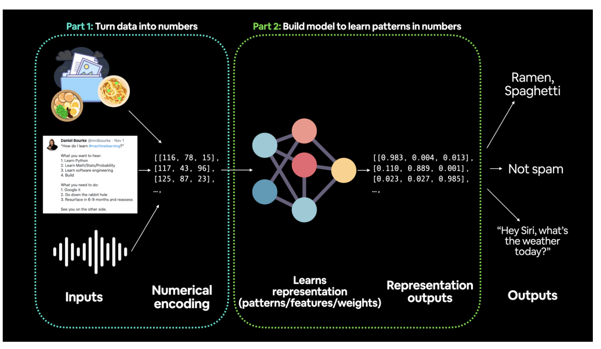

# PyTorch Workflow Fundamentals

get torch, torch.nn (nn stands for neural network and this package contains the building blocks for creating neural networks in PyTorch) and matplotlib.

# 1. Data (preparing and loading)

