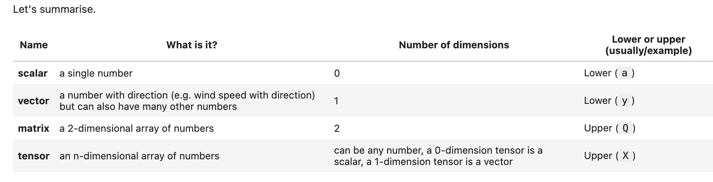
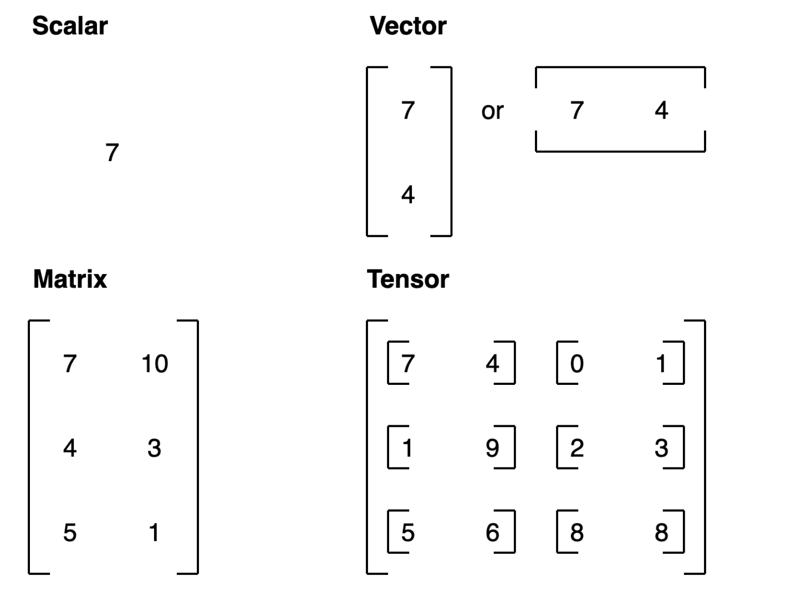
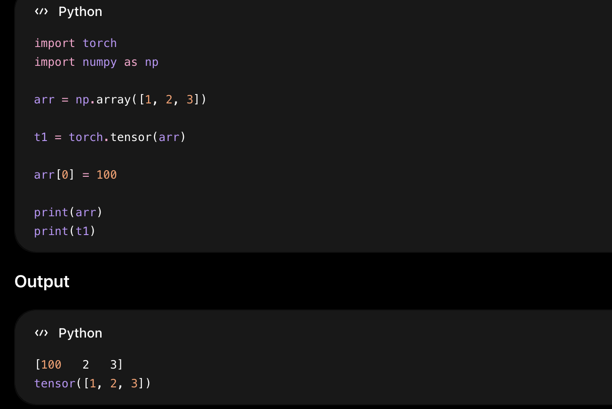
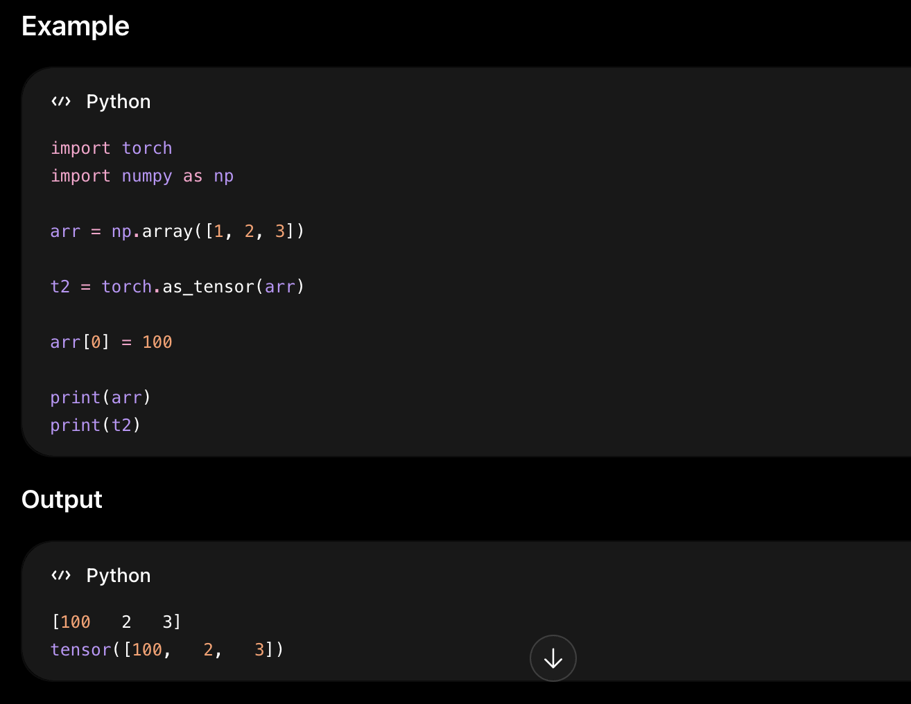
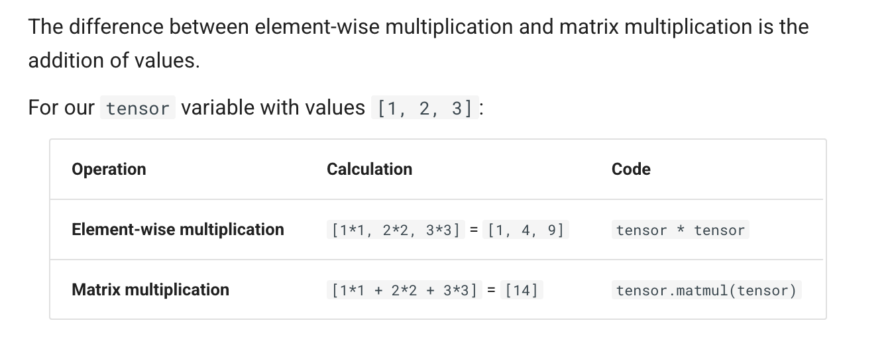

# What is PyTorch?
PyTorch is an open source machine learning and deep learning framework.

## What can PyTorch be used for?
PyTorch allows you to manipulate and process data and write machine learning algorithms using Python code.

## Why to use PyTorch?
PyTorch also helps take care of many things such as GPU acceleration (making your code run faster) behind the scenes.

So you can focus on manipulating data and writing algorithms and PyTorch will make sure it runs fast.

# Introduction to tensors
Tensors are the fundamental building block of machine learning.
Their job is to represent data in a numerical way.

## Creating tensors
The first thing we're going to create is a ###scalar.

A scalar is a single number and in tensor-speak (the language used to describe tensors), it's a zero dimension tensor.

Okay, now let's see a ###vector.
A vector is a single dimension tensor but can contain many numbers.
As in, you could have a vector [3, 2] to describe [bedrooms, bathrooms] in your house. Or you could have [3, 2, 2] to describe [bedrooms, bathrooms, car_parks] in your house.
The important trend here is that a vector is flexible in what it can represent (the same with tensors).

the number of dimensions a tensor in PyTorch has by the number of square brackets on the outside ([) and you only need to count one side.

Let's now see a ###matrix.
MATRIX has two dimensions
torch.Size([2, 2]) because MATRIX is two elements deep and two elements wide.

# playing with tensors
## torch.tensor
A torch.Tensor is a multi-dimensional matrix containing elements of a single data type.
torch.tensor() always copies data. If you have a Tensor data and just want to change its requires_grad flag, use requires_grad_() or detach() to avoid a copy. If you have a numpy array and want to avoid a copy, use torch.as_tensor().
torch.tensor() → Always creates a copy
PyTorch allocates new memory and copies the data.

Why?
t1 does NOT change because torch.tensor() copied the NumPy data into a new tensor.

torch.as_tensor() → Avoids copy when possible
torch.as_tensor() tries to share memory with the original object.

Why?
Both share the same memory.
So changing the NumPy array also changes the tensor.

torch.as_tensor() tries to share memory with the original object.
# Summary Table
| Method              | Copies Data? | Shares Memory? | Keeps Grad History? |
| ------------------- | ------------ | -------------- | ------------------- |
| `torch.tensor()`    | Yes          | No             | No                  |
| `torch.as_tensor()` | Usually No   | Yes            | No                  |
| `requires_grad_()`  | No           | Yes            | Yes                 |
| `detach()`          | No           | Yes            | Removes history     |

A tensor of specific data type can be constructed by passing a torch.dtype and/or a torch.device to a constructor or tensor creation op

torch.device is used in PyTorch to specify where a tensor or model should be stored and computed.
It tells PyTorch whether to use:
CPU
GPU (CUDA)
other hardware accelerators
# summary
| Device     | Meaning        |
| ---------- | -------------- |
| `"cpu"`    | Use processor  |
| `"cuda"`   | Use NVIDIA GPU |
| `"cuda:0"` | First GPU      |
| `"cuda:1"` | Second GPU     |
To change an existing tensor’s torch.device and/or torch.dtype, consider using to() method on the tensor.

# Slicing
The contents of a tensor can be accessed and modified using Python’s indexing and slicing notation:
Use torch.Tensor.item() to get a Python number from a tensor containing a single value
torch.FloatTensor.abs_() computes the absolute value in-place and returns the modified tensor, while torch.FloatTensor.abs() computes the result in a new tensor.

# demonstrates automatic differentiation in PyTorch Autograd
PyTorch automatically computes derivatives (gradients) using the computation graph.

import torch
x = torch.tensor([[1., -1.],
                  [1.,  1.]], requires_grad=True)
out = x.pow(2).sum()
out.backward()
print(x.grad)

##visual flow
x
 ↓
square
 ↓
sum
 ↓
out
 ↓ backward()
gradients stored in x.grad

## Why is this useful?
Deep learning training works using gradients.
PyTorch computes derivatives automatically for:
neural networks
loss functions
optimization
instead of manually calculating calculus.

# Randam Tensors
A machine learning model often starts out with large random tensors of numbers and adjusts these random numbers as it works through data to better represent it.

In essence:
Start with random numbers -> look at data -> update random numbers -> look at data -> update random numbers...

As a data scientist, you can define how the machine learning model starts (initialization), looks at data (representation) and updates (optimization) its random numbers.
using torch.rand() and passing in the size parameter.

## Creating a range and tensors like
Sometimes you might want a range of numbers, such as 1 to 10 or 0 to 100.
You can use torch.arange(start, end, step) to do so.
Where:
start = start of range (e.g. 0)
end = end of range (e.g. 10)
step = how many steps in between each value (e.g. 1)
Note: In Python, you can use range() to create a range. However in PyTorch, torch.range() is deprecated and may show an error in the future.

Sometimes you might want one tensor of a certain type with the same shape as another tensor.

For example, a tensor of all zeros with the same shape as a previous tensor.

To do so you can use torch.zeros_like(input) or torch.ones_like(input) which return a tensor filled with zeros or ones in the same shape as the input respectively.
## Can also create a tensor of zeros similar to another tensor
ten_zeros = torch.zeros_like(input=zero_to_ten) # will have same shape
ten_zeros

# Tensor datatypes
The reason for having many datatypes (float16, float32, int8, etc.) is mainly:

Trade-off between:
Precision (accuracy of numbers)
Memory usage
Computation speed

You cannot maximize all three at once.

## Precision in Computing
Precision is the amount of detail used to describe a number.
Precision means:
    How accurately a computer can store numbers.

This matters in deep learning and numerical computing because you're making so many operations, the more detail you have to calculate on, the more compute you have to use.

So lower precision datatypes are generally faster to compute on but sacrifice some performance on evaluation metrics like accuracy (faster to compute but less accurate).

## Example of Different Float Types
| Datatype  | Bits | Precision | Memory  | Speed    |
| --------- | ---- | --------- | ------- | -------- |
| `float16` | 16   | Lower     | Smaller | Faster   |
| `float32` | 32   | Medium    | Normal  | Standard |
| `float64` | 64   | Very High | Large   | Slower   |

# Manipulating tensors (tensor operations)
In deep learning, data (images, text, video, audio, protein structures, etc) gets represented as tensors.

## Basic operations
fundamental operations, addition (+), subtraction (-), mutliplication (*).

PyTorch also has a bunch of built-in functions like torch.mul() (short for multiplication) and torch.add() to perform basic operations.

# Matrix multiplication 
One of the most common operations in machine learning and deep learning algorithms (like neural networks) is matrix multiplication.

PyTorch implements matrix multiplication functionality in the torch.matmul() method.

The main two rules for matrix multiplication to remember are:

The inner dimensions must match:
(3, 2) @ (3, 2) won't work
(2, 3) @ (3, 2) will work
(3, 2) @ (2, 3) will work
The resulting matrix has the shape of the outer dimensions:
(2, 3) @ (3, 2) -> (2, 2)
(3, 2) @ (2, 3) -> (3, 3)

%%time is a Jupyter Notebook magic command used to measure how long a code cell takes to execute.

It is commonly used in:
Jupyter Notebook
Google Colab
Kaggle notebooks

| Term      | Meaning                          |
| --------- | -------------------------------- |
| user      | Time CPU spent running your code |
| sys       | Time spent by system/kernel      |
| total     | user + sys                       |
| wall time | Actual real-world elapsed time   |

| Command    | Measures              |
| ---------- | --------------------- |
| `%time`    | One line              |
| `%%time`   | Whole cell            |
| `%%timeit` | Repeated benchmarking |

# One of the most common errors in deep learning (shape errors)
We can make matrix multiplication work between tensor_A and tensor_B by making their inner dimensions match otherwise it will show error.

One of the ways to do this is with a transpose (switch the dimensions of a given tensor).

You can perform transposes in PyTorch using either:

torch.transpose(input, dim0, dim1) - where input is the desired tensor to transpose and dim0 and dim1 are the dimensions to be swapped.
tensor.T - where tensor is the desired tensor to transpose.
You can also use torch.mm() which is a short for torch.matmul()

## How a neural network layer like torch.nn.Linear() works internally using matrix multiplication.

A linear layer performs:
y = x.A^T+b
where:
x = input
A = weights matrix
A^T = transpose of weights
b = bias
y = output
Try changing the values of in_features and out_features below and see what happens.

torch.manual_seed(42)

linear = torch.nn.Linear(
    in_features=2, # in_features = matches inner dimension of input 
    out_features=6 # out_features = describes outer value 
)

x = tensor_A

output = linear(x)
