# PyTorch Workflow Fundamentals

get torch, torch.nn (nn stands for neural network and this package contains the building blocks for creating neural networks in PyTorch) and matplotlib.

# 1. Data (preparing and loading)

Machine learning is a game of two parts:

Turn your data, whatever it is, into numbers (a representation).

Pick or build a model to learn the representation as best as possible.
Sometimes one and two can be done at the same time.

But what if you don't have data?

## Creating data
Let's create our data as a straight line.

We'll use linear regression to create the data with known parameters (things that can be learned by a model) and then we'll use PyTorch to see if we can build model to estimate these parameters using gradient descent.

### Create known parameters
weight = 0.7

bias = 0.3

### Create data
start = 0

end = 1

step = 0.02

X = torch.arange(start, end, step).unsqueeze(dim=1)

y = weight * X + bias

X[:10], y[:10]

Beautiful! Now we're going to move towards building a model that can learn the relationship between X (features) and y (labels).

## Split data into training and test sets

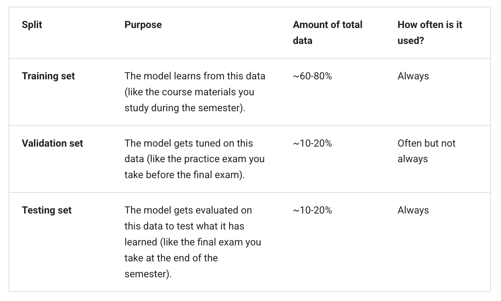

### visualize it

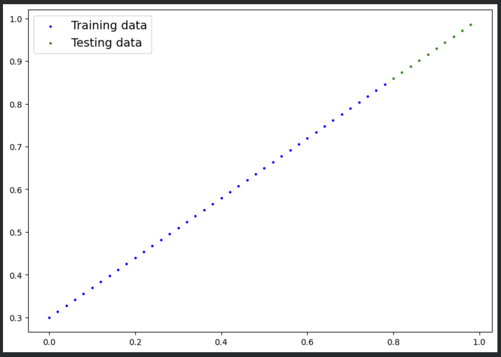

# 2. Build Model
## PyTorch model building essentials

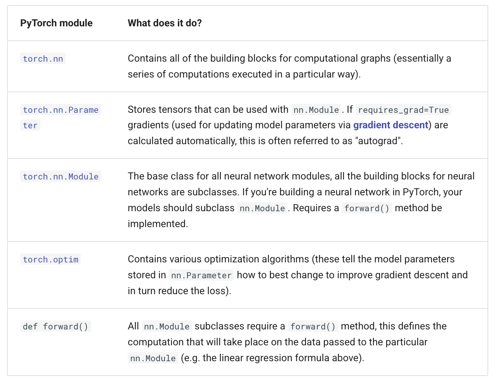

If the above sounds complex, think of like this, almost everything in a PyTorch neural network comes from torch.nn,

nn.Module contains the larger building blocks (layers)

nn.Parameter contains the smaller parameters like weights and biases (put these together to make nn.Module(s))

forward() tells the larger blocks how to make calculations on inputs (tensors full of data) within nn.Module(s)

torch.optim contains optimization methods on how to improve the parameters within nn.Parameter to better represent input data

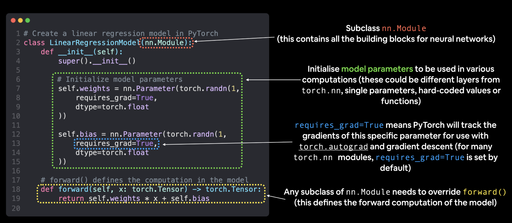

## Checking the contents of a PyTorch model

let's create a model instance with the class we've made and check its parameters using .parameters().

also get the state (what the model contains) of the model using .state_dict().

## Making predictions 

torch.inference_mode() turns off a bunch of things (like gradient tracking, which is necessary for training but not for inference) to make forward-passes (data going through the forward() method) faster.

While torch.inference_mode() and torch.no_grad() do similar things, torch.inference_mode() is newer, potentially faster and preferred. 

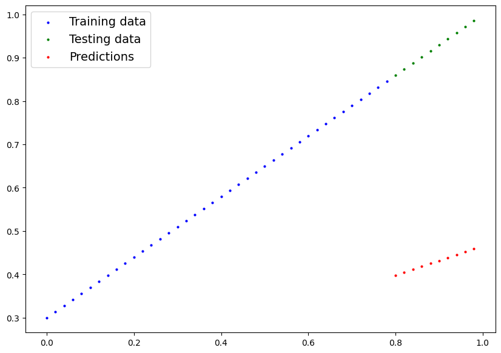

Woah! Those predictions look pretty bad...

# 3. Train model

Right now our model is making predictions using random parameters to make calculations, it's basically guessing (randomly).

To fix that, we can update its internal parameters 

Instead, it's much more fun to write code to see if the model can try and figure them out itself.

## Creating a loss function and optimizer in PyTorch

For our model to update its parameters on its own, we'll need to add a few more things to our recipe.

And that's a loss function as well as an optimizer.

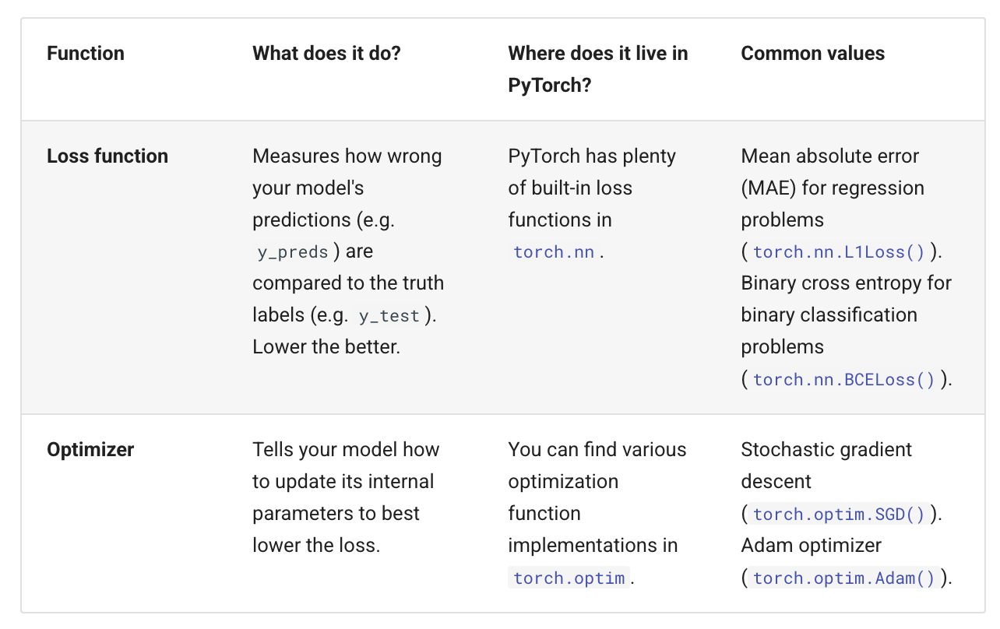

Let's create a loss function and an optimizer we can use to help improve our model.

Depending on what kind of problem you're working on will depend on what loss function and what optimizer you use.

For our problem, since we're predicting a number, let's use MAE (which is under torch.nn.L1Loss()) in PyTorch as our loss function.

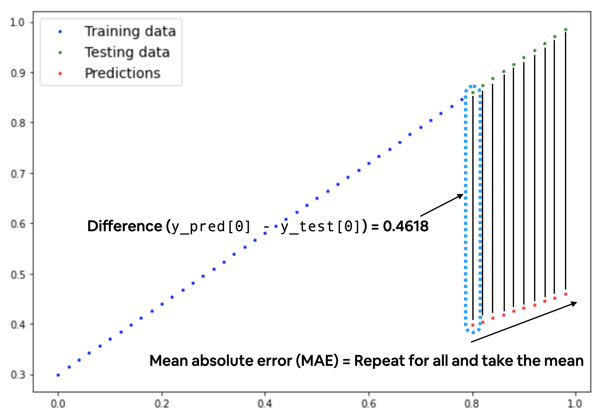

Mean absolute error (MAE, in PyTorch: torch.nn.L1Loss) measures the absolute difference between two points (predictions and labels) and then takes the mean across all examples.

And we'll use SGD, torch.optim.SGD(params, lr) where:

params is the target model parameters you'd like to optimize (e.g. the weights and bias values we randomly set before).

lr is the learning rate you'd like the optimizer to update the parameters at, higher means the optimizer will try larger updates (these can sometimes be too large and the optimizer will fail to work), lower means the optimizer will try smaller updates (these can sometimes be too small and the optimizer will take too long to find the ideal values). The learning rate is considered a hyperparameter (because it's set by a machine learning engineer). Common starting values for the learning rate are 0.01, 0.001, 0.0001, however, these can also be adjusted over time (this is called learning rate scheduling).

## Creating an optimization loop in PyTorch

The training loop involves the model going through the training data and learning the relationships between the features and labels.

The testing loop involves going through the testing data and evaluating how good the patterns are that the model learned on the training data (the model never sees the testing data during training).

Each of these is called a "loop" because we want our model to look (loop through) at each sample in each dataset.

## PyTorch training loop

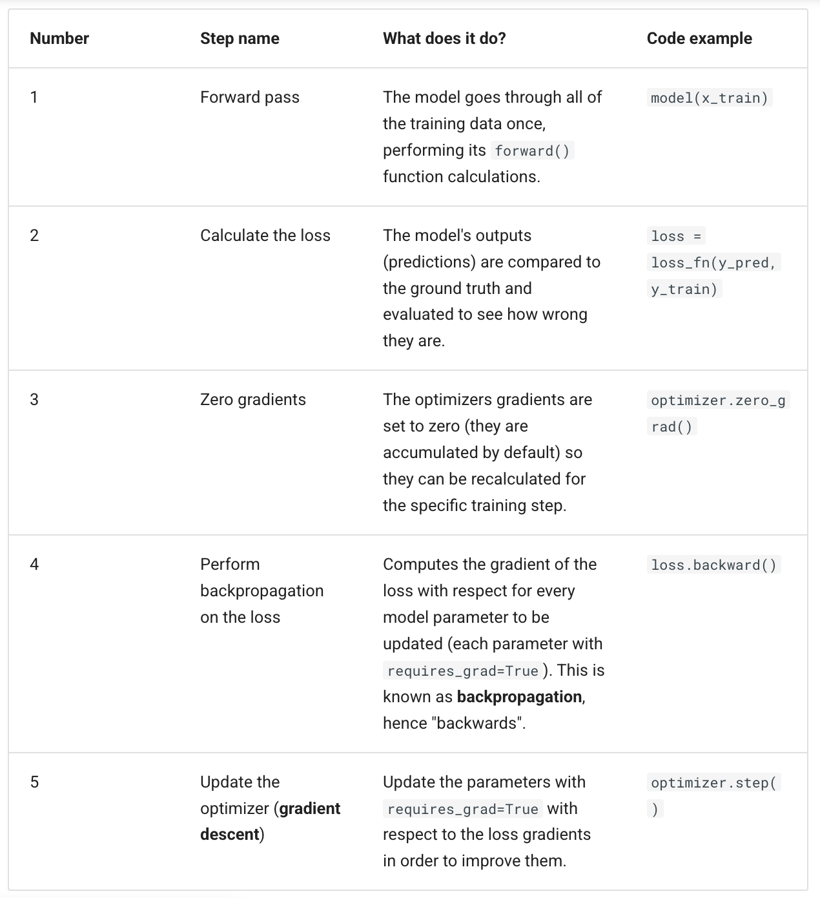

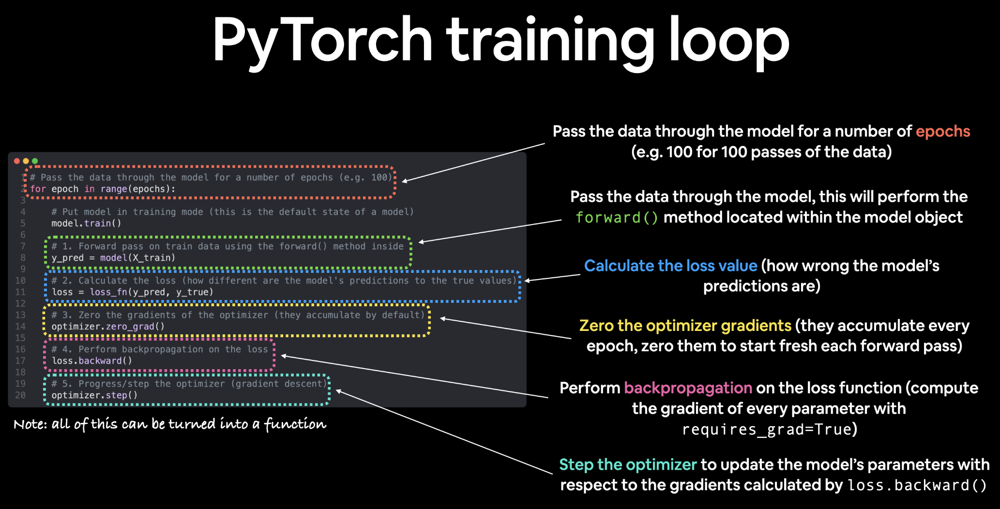

## PyTorch testing loop

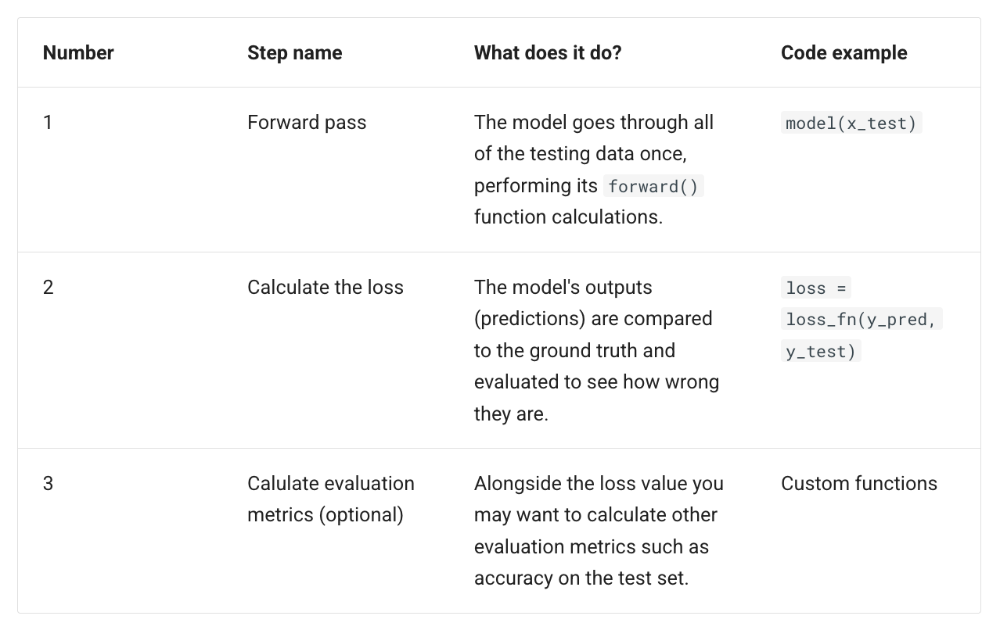

Notice the testing loop doesn't contain performing backpropagation (loss.backward()) or stepping the optimizer (optimizer.step()), this is because no parameters in the model are being changed during testing, they've already been calculated. For testing, we're only interested in the output of the forward pass through the model.

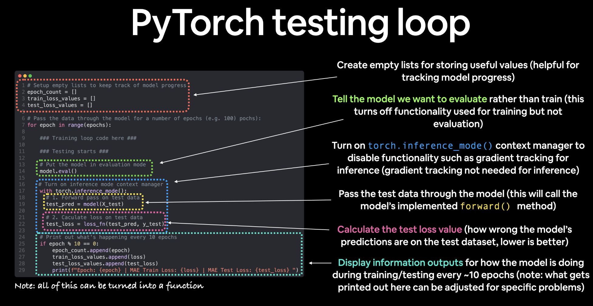

## loss curve

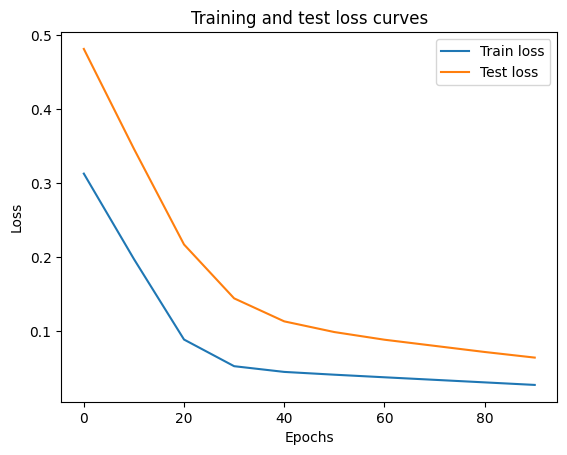

The loss curves show the loss going down over time. Remember, loss is the measure of how wrong your model is, so the lower the better.

why did the loss go down?

Well, thanks to our loss function and optimizer, the model's internal parameters (weights and bias) were updated to better reflect the underlying patterns in the data.

Let's inspect our model's .state_dict() to see how close our model gets to the original values we set for weights and bias.

This is the whole idea of machine learning and deep learning, there are some ideal values that describe our data and rather than figuring them out by hand, we can train a model to figure them out programmatically.

# 4. Making predictions with a trained PyTorch model

There are three things to remember when making predictions (also called performing inference) with a PyTorch model:

Set the model in evaluation mode (model.eval()).

Make the predictions using the inference mode context manager (with torch.inference_mode(): ...).

All predictions should be made with objects on the same device (e.g. data and model on GPU only or data and model on CPU only).

The first two items make sure all helpful calculations and settings PyTorch uses behind the scenes during training but aren't necessary for inference are turned off (this results in faster computation). 

And the third ensures that you won't run into cross-device errors.

# 5. Saving and loading a PyTorch model

For saving and loading models in PyTorch, there are three main methods you should be aware of

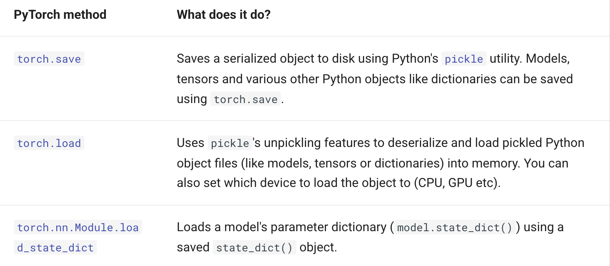

## Saving a PyTorch model's state_dict()

The recommended way for saving and loading a model for inference (making predictions) is by saving and loading a model's state_dict().

Let's see how we can do that in a few steps:

We'll create a directory for saving models to called models using Python's pathlib module.

We'll create a file path to save the model to.

We'll call torch.save(obj, f) where obj is the target model's state_dict() and f is the filename of where to save the model.

## Loading a saved PyTorch model's state_dict()

Since we've now got a saved model state_dict() at models/01_pytorch_workflow_model_0.pth we can now load it in using torch.nn.Module.load_state_dict(torch.load(f)) where f is the filepath of our saved model state_dict().

Why call torch.load() inside torch.nn.Module.load_state_dict()?

Because we only saved the model's state_dict() which is a dictionary of learned parameters and not the entire model, we first have to load the state_dict() with torch.load() and then pass that state_dict() to a new instance of our model (which is a subclass of nn.Module).

